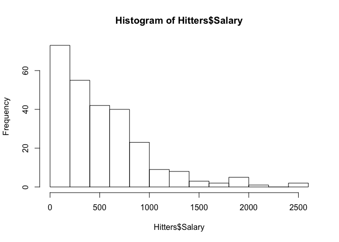
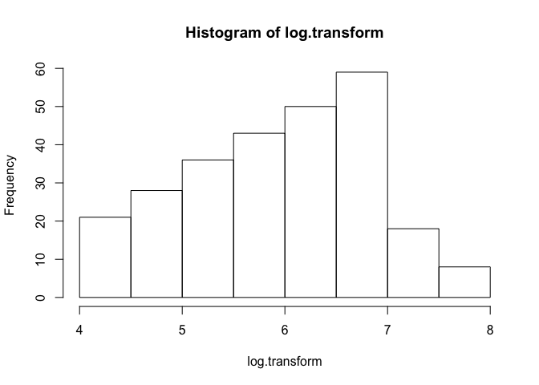
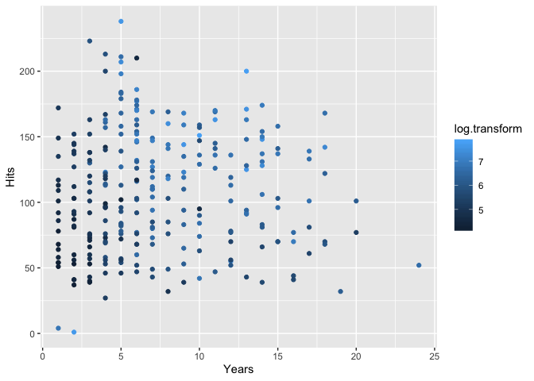
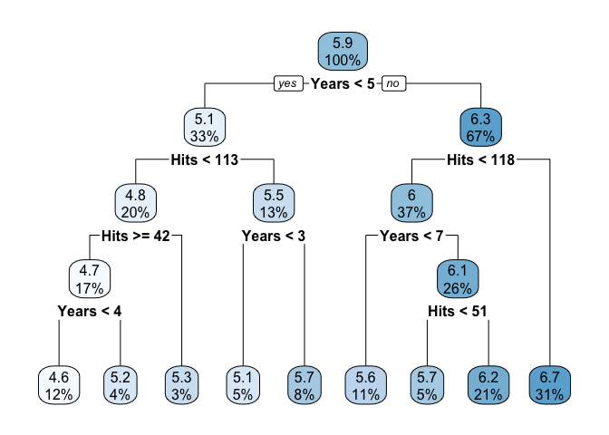
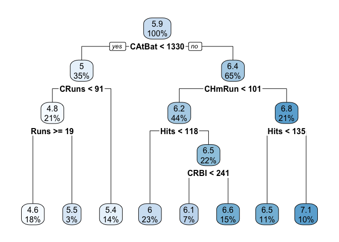
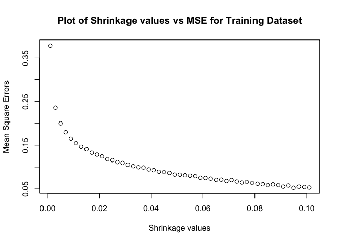
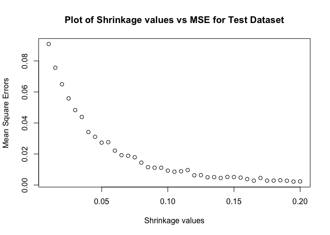
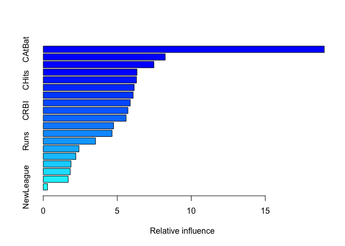
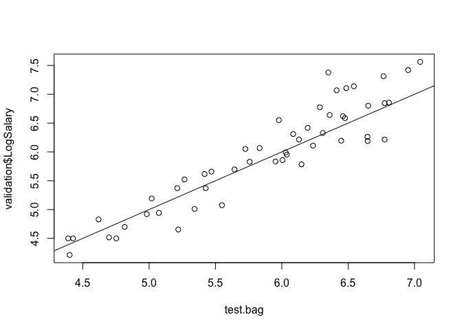

Predicting the salary of Hitters
================
Manoj Bhandari

``` r
if(!require("pacman")) install.packages("pacman")
```

    ## Loading required package: pacman

``` r
pacman::p_load(ISLR, caret, ggplot2, rpart, rpart.plot, gbm, leaps, randomForest)
```

``` r
# Loading the Library and Data Set
data("Hitters")
```

``` r
# Converting the data set into a data frame
hitters.df <- Hitters
```

## Remove the observations with unknown salary information.

``` r
#Creating a new data frame after removing all the missing salary observations
hitters.new.df <- as.data.frame(hitters.df[complete.cases(hitters.df$Salary),])

#Number of observations removed
removed <- sum(is.na(hitters.df$Salary))
```

### 59 records were removed

## Generate log-transform the salaries.

``` r
log.transform <- log(hitters.new.df$Salary)
hist(Hitters$Salary)
```

<!-- -->

``` r
hist(log.transform)
```

<!-- -->

### Here, log-transformation is used to convert a highly skewed salary data into a relatively lesser skewed (normalized) data.

## Create a scatterplot with Hits on the y-axis and Years on the x-axis using all the observations. Color code the observations using the log Salary variable.

``` r
ggplot(hitters.new.df,aes(Years,Hits)) +
  geom_point(aes(colour = log.transform))
```

<!-- -->

### According to the scatterplot and the colour scale, the log salary is higher for players with ~5+ years of experience and ~100+ hits.

## Run a linear regression model of Log Salary on all the predictors using the entire dataset. Use regsubsets() function to perform best subset selection from the regression model. Identify the best model using BIC. Which predictor variables are included in this (best) model?

``` r
#removing salary column 
hitters.new.df$Salary <- NULL

#Adding the log.transform column to the main data frame
hitters.new.df$LogSalary <- log.transform

#running regression
hitters.lm <- lm(LogSalary~.,data = hitters.new.df)

summary(hitters.lm)
```

    ## 
    ## Call:
    ## lm(formula = LogSalary ~ ., data = hitters.new.df)
    ## 
    ## Residuals:
    ##      Min       1Q   Median       3Q      Max 
    ## -2.22870 -0.45350  0.09424  0.40474  2.77223 
    ## 
    ## Coefficients:
    ##               Estimate Std. Error t value Pr(>|t|)    
    ## (Intercept)  4.618e+00  1.765e-01  26.171  < 2e-16 ***
    ## AtBat       -2.984e-03  1.232e-03  -2.421  0.01620 *  
    ## Hits         1.308e-02  4.622e-03   2.831  0.00503 ** 
    ## HmRun        1.179e-02  1.205e-02   0.978  0.32889    
    ## Runs        -1.419e-03  5.794e-03  -0.245  0.80670    
    ## RBI         -1.675e-03  5.056e-03  -0.331  0.74063    
    ## Walks        1.096e-02  3.554e-03   3.082  0.00229 ** 
    ## Years        5.696e-02  2.413e-02   2.361  0.01902 *  
    ## CAtBat       1.283e-04  2.629e-04   0.488  0.62596    
    ## CHits       -4.414e-04  1.311e-03  -0.337  0.73670    
    ## CHmRun      -7.809e-05  3.144e-03  -0.025  0.98020    
    ## CRuns        1.513e-03  1.459e-03   1.037  0.30072    
    ## CRBI         1.312e-04  1.346e-03   0.097  0.92246    
    ## CWalks      -1.466e-03  6.377e-04  -2.298  0.02239 *  
    ## LeagueN      2.825e-01  1.541e-01   1.833  0.06797 .  
    ## DivisionW   -1.656e-01  7.847e-02  -2.111  0.03580 *  
    ## PutOuts      3.389e-04  1.505e-04   2.251  0.02526 *  
    ## Assists      6.214e-04  4.300e-04   1.445  0.14970    
    ## Errors      -1.197e-02  8.537e-03  -1.402  0.16225    
    ## NewLeagueN  -1.742e-01  1.536e-01  -1.134  0.25788    
    ## ---
    ## Signif. codes:  0 '***' 0.001 '**' 0.01 '*' 0.05 '.' 0.1 ' ' 1
    ## 
    ## Residual standard error: 0.6135 on 243 degrees of freedom
    ## Multiple R-squared:  0.5586, Adjusted R-squared:  0.524 
    ## F-statistic: 16.18 on 19 and 243 DF,  p-value: < 2.2e-16

``` r
#subset selection
search <- regsubsets(LogSalary ~ ., data = hitters.new.df, nbest = 1, nvmax = dim(hitters.new.df)[2],
                     method = "exhaustive")
sum <- summary(search)

sum$bic
```

    ##  [1] -117.0304 -156.4291 -159.2777 -159.2182 -159.0885 -157.9207 -157.1229
    ##  [8] -156.1954 -152.7649 -148.8061 -144.5962 -140.6541 -136.5480 -131.0939
    ## [15] -125.7112 -120.1995 -114.7125 -109.1859 -103.6145

``` r
which.min(sum$bic)
```

    ## [1] 3

``` r
sum$which[(which.min(sum$bic)),]
```

    ## (Intercept)       AtBat        Hits       HmRun        Runs         RBI 
    ##        TRUE       FALSE        TRUE       FALSE       FALSE       FALSE 
    ##       Walks       Years      CAtBat       CHits      CHmRun       CRuns 
    ##        TRUE        TRUE       FALSE       FALSE       FALSE       FALSE 
    ##        CRBI      CWalks     LeagueN   DivisionW     PutOuts     Assists 
    ##       FALSE       FALSE       FALSE       FALSE       FALSE       FALSE 
    ##      Errors  NewLeagueN 
    ##       FALSE       FALSE

### We can see that Hits, Walks and Years are the three predictor variables included in the best model.

## Now create a training data set consisting of 80 percent of the observations, and a test data set consisting of the remaining observations.

``` r
set.seed(42) 
# Create data partition
partition <- createDataPartition(hitters.new.df$LogSalary, p=0.8, list = FALSE)

# Create data frame with training data
training <- hitters.new.df[partition,]
# Create data frame with test/validation data
validation <- hitters.new.df[-partition,]
```

## Generate a regression tree of log Salary using only Years and Hits variables from the training data set. Which players are likely to receive highest salaries according to this model?

``` r
# Generate regression tree using only Years and Hits as predictors
salary.tree <- rpart(LogSalary~ Years + Hits, training)
summary(salary.tree)
```

    ## Call:
    ## rpart(formula = LogSalary ~ Years + Hits, data = training)
    ##   n= 212 
    ## 
    ##           CP nsplit rel error    xerror       xstd
    ## 1 0.42633247      0 1.0000000 1.0140639 0.07340074
    ## 2 0.11655032      1 0.5736675 0.5865620 0.06788478
    ## 3 0.03751440      2 0.4571172 0.4965007 0.06716200
    ## 4 0.02450593      3 0.4196028 0.5011562 0.07317841
    ## 5 0.01471508      4 0.3950969 0.4822315 0.07325505
    ## 6 0.01419923      5 0.3803818 0.4934601 0.07854788
    ## 7 0.01272645      7 0.3519833 0.4899783 0.07894188
    ## 8 0.01000000      8 0.3392569 0.4816827 0.07909190
    ## 
    ## Variable importance
    ## Years  Hits 
    ##    70    30 
    ## 
    ## Node number 1: 212 observations,    complexity param=0.4263325
    ##   mean=5.923586, MSE=0.7900778 
    ##   left son=2 (69 obs) right son=3 (143 obs)
    ##   Primary splits:
    ##       Years < 4.5   to the left,  improve=0.4263325, (0 missing)
    ##       Hits  < 117.5 to the left,  improve=0.1965698, (0 missing)
    ##   Surrogate splits:
    ##       Hits < 29.5  to the left,  agree=0.689, adj=0.043, (0 split)
    ## 
    ## Node number 2: 69 observations,    complexity param=0.0375144
    ##   mean=5.088074, MSE=0.4701937 
    ##   left son=4 (42 obs) right son=5 (27 obs)
    ##   Primary splits:
    ##       Hits  < 113   to the left,  improve=0.1936769, (0 missing)
    ##       Years < 3.5   to the left,  improve=0.1556438, (0 missing)
    ## 
    ## Node number 3: 143 observations,    complexity param=0.1165503
    ##   mean=6.326735, MSE=0.4450625 
    ##   left son=6 (78 obs) right son=7 (65 obs)
    ##   Primary splits:
    ##       Hits  < 117.5 to the left,  improve=0.30673420, (0 missing)
    ##       Years < 6.5   to the left,  improve=0.05862589, (0 missing)
    ## 
    ## Node number 4: 42 observations,    complexity param=0.01419923
    ##   mean=4.846119, MSE=0.4591726 
    ##   left son=8 (35 obs) right son=9 (7 obs)
    ##   Primary splits:
    ##       Hits  < 42    to the right, improve=0.1046318, (0 missing)
    ##       Years < 3.5   to the left,  improve=0.0981606, (0 missing)
    ## 
    ## Node number 5: 27 observations,    complexity param=0.01272645
    ##   mean=5.464449, MSE=0.2546142 
    ##   left son=10 (10 obs) right son=11 (17 obs)
    ##   Primary splits:
    ##       Years < 2.5   to the left,  improve=0.3100747, (0 missing)
    ##       Hits  < 154.5 to the left,  improve=0.2753220, (0 missing)
    ## 
    ## Node number 6: 78 observations,    complexity param=0.02450593
    ##   mean=5.989447, MSE=0.3493758 
    ##   left son=12 (23 obs) right son=13 (55 obs)
    ##   Primary splits:
    ##       Years < 6.5   to the left,  improve=0.15062240, (0 missing)
    ##       Hits  < 72.5  to the left,  improve=0.08789166, (0 missing)
    ##   Surrogate splits:
    ##       Hits < 112.5 to the right, agree=0.731, adj=0.087, (0 split)
    ## 
    ## Node number 7: 65 observations
    ##   mean=6.731481, MSE=0.2595516 
    ## 
    ## Node number 8: 35 observations,    complexity param=0.01419923
    ##   mean=4.748095, MSE=0.174288 
    ##   left son=16 (26 obs) right son=17 (9 obs)
    ##   Primary splits:
    ##       Years < 3.5   to the left,  improve=0.4489766, (0 missing)
    ##       Hits  < 68.5  to the left,  improve=0.1256046, (0 missing)
    ## 
    ## Node number 9: 7 observations
    ##   mean=5.336242, MSE=1.595331 
    ## 
    ## Node number 10: 10 observations
    ##   mean=5.098096, MSE=0.02167841 
    ## 
    ## Node number 11: 17 observations
    ##   mean=5.67995, MSE=0.266245 
    ## 
    ## Node number 12: 23 observations
    ##   mean=5.634708, MSE=0.2731994 
    ## 
    ## Node number 13: 55 observations,    complexity param=0.01471508
    ##   mean=6.137792, MSE=0.3066013 
    ##   left son=26 (10 obs) right son=27 (45 obs)
    ##   Primary splits:
    ##       Hits  < 50.5  to the left,  improve=0.14616100, (0 missing)
    ##       Years < 7.5   to the right, improve=0.03966411, (0 missing)
    ## 
    ## Node number 16: 26 observations
    ##   mean=4.583513, MSE=0.07930576 
    ## 
    ## Node number 17: 9 observations
    ##   mean=5.223551, MSE=0.1443708 
    ## 
    ## Node number 26: 10 observations
    ##   mean=5.688727, MSE=0.2432422 
    ## 
    ## Node number 27: 45 observations
    ##   mean=6.237584, MSE=0.2659094

``` r
# Plot the regression tree
rpart.plot(salary.tree)
```

<!-- -->

### According to the regression tree using only years and hits, the players with more than 5 years of experience and more than 118 hits are likely to receive highest salaries. The branch with the logSalary value of 6.7 follow this rule and shows 31% of the data.

## Now create a regression tree using all the variables in the training data set. Perform boosting on the training set with 1,000 trees for a range of values of the shrinkage parameter lambda. Produce a plot with different shrinkage values on the x- axis and the corresponding training set MSE on the y-axis.

``` r
# Generate regression tree using all the predictors
salary.tree.1 <- rpart(LogSalary~ ., training)
summary(salary.tree.1)
```

    ## Call:
    ## rpart(formula = LogSalary ~ ., data = training)
    ##   n= 212 
    ## 
    ##           CP nsplit rel error    xerror       xstd
    ## 1 0.55135671      0 1.0000000 1.0066497 0.07305976
    ## 2 0.05834488      1 0.4486433 0.4804035 0.06344758
    ## 3 0.04189138      2 0.3902984 0.4572746 0.06691197
    ## 4 0.02919914      3 0.3484070 0.4383191 0.07325143
    ## 5 0.02838394      4 0.3192079 0.4225515 0.07188270
    ## 6 0.01938340      5 0.2908240 0.4071116 0.07147896
    ## 7 0.01793890      6 0.2714406 0.3994112 0.07163687
    ## 8 0.01000000      7 0.2535017 0.3988895 0.07105675
    ## 
    ## Variable importance
    ##  CAtBat   CHits   CRuns    CRBI  CWalks   Years    Runs    Hits   AtBat 
    ##      17      17      17      16      14      10       2       2       2 
    ##  CHmRun   Walks     RBI PutOuts 
    ##       2       1       1       1 
    ## 
    ## Node number 1: 212 observations,    complexity param=0.5513567
    ##   mean=5.923586, MSE=0.7900778 
    ##   left son=2 (74 obs) right son=3 (138 obs)
    ##   Primary splits:
    ##       CAtBat < 1329.5 to the left,  improve=0.5513567, (0 missing)
    ##       CHits  < 419    to the left,  improve=0.5442920, (0 missing)
    ##       CRuns  < 208.5  to the left,  improve=0.5356312, (0 missing)
    ##       CRBI   < 121    to the left,  improve=0.5149909, (0 missing)
    ##       CWalks < 120    to the left,  improve=0.5119708, (0 missing)
    ##   Surrogate splits:
    ##       CHits  < 324    to the left,  agree=0.986, adj=0.959, (0 split)
    ##       CRuns  < 158    to the left,  agree=0.976, adj=0.932, (0 split)
    ##       CRBI   < 119.5  to the left,  agree=0.953, adj=0.865, (0 split)
    ##       CWalks < 120    to the left,  agree=0.934, adj=0.811, (0 split)
    ##       Years  < 4.5    to the left,  agree=0.873, adj=0.635, (0 split)
    ## 
    ## Node number 2: 74 observations,    complexity param=0.04189138
    ##   mean=5.022274, MSE=0.349524 
    ##   left son=4 (45 obs) right son=5 (29 obs)
    ##   Primary splits:
    ##       CRuns  < 91     to the left,  improve=0.2712824, (0 missing)
    ##       CHits  < 182    to the left,  improve=0.2650167, (0 missing)
    ##       CAtBat < 689    to the left,  improve=0.2484637, (0 missing)
    ##       CRBI   < 55.5   to the left,  improve=0.2461947, (0 missing)
    ##       CWalks < 63.5   to the left,  improve=0.1685103, (0 missing)
    ##   Surrogate splits:
    ##       CHits  < 172.5  to the left,  agree=0.973, adj=0.931, (0 split)
    ##       CAtBat < 689    to the left,  agree=0.959, adj=0.897, (0 split)
    ##       CRBI   < 60     to the left,  agree=0.878, adj=0.690, (0 split)
    ##       CWalks < 63.5   to the left,  agree=0.851, adj=0.621, (0 split)
    ##       Years  < 3.5    to the left,  agree=0.743, adj=0.345, (0 split)
    ## 
    ## Node number 3: 138 observations,    complexity param=0.05834488
    ##   mean=6.406898, MSE=0.3571116 
    ##   left son=6 (94 obs) right son=7 (44 obs)
    ##   Primary splits:
    ##       CHmRun < 101    to the left,  improve=0.1983012, (0 missing)
    ##       Walks  < 59.5   to the left,  improve=0.1947176, (0 missing)
    ##       Hits   < 117.5  to the left,  improve=0.1936239, (0 missing)
    ##       CRBI   < 324.5  to the left,  improve=0.1862495, (0 missing)
    ##       AtBat  < 369    to the left,  improve=0.1862096, (0 missing)
    ##   Surrogate splits:
    ##       CRBI   < 525    to the left,  agree=0.913, adj=0.727, (0 split)
    ##       CRuns  < 707.5  to the left,  agree=0.877, adj=0.614, (0 split)
    ##       CAtBat < 4975   to the left,  agree=0.862, adj=0.568, (0 split)
    ##       CHits  < 1331   to the left,  agree=0.855, adj=0.545, (0 split)
    ##       CWalks < 472    to the left,  agree=0.841, adj=0.500, (0 split)
    ## 
    ## Node number 4: 45 observations,    complexity param=0.02838394
    ##   mean=4.775078, MSE=0.379853 
    ##   left son=8 (38 obs) right son=9 (7 obs)
    ##   Primary splits:
    ##       Runs  < 18.5   to the right, improve=0.2781316, (0 missing)
    ##       AtBat < 173    to the right, improve=0.2727753, (0 missing)
    ##       Hits  < 39.5   to the right, improve=0.2419642, (0 missing)
    ##       RBI   < 12.5   to the right, improve=0.2039077, (0 missing)
    ##       Walks < 13     to the right, improve=0.1354265, (0 missing)
    ##   Surrogate splits:
    ##       AtBat < 147    to the right, agree=0.956, adj=0.714, (0 split)
    ##       Hits  < 39.5   to the right, agree=0.956, adj=0.714, (0 split)
    ##       CRuns < 18.5   to the right, agree=0.933, adj=0.571, (0 split)
    ##       Walks < 6      to the right, agree=0.911, adj=0.429, (0 split)
    ##       CHits < 50     to the right, agree=0.911, adj=0.429, (0 split)
    ## 
    ## Node number 5: 29 observations
    ##   mean=5.405855, MSE=0.06050789 
    ## 
    ## Node number 6: 94 observations,    complexity param=0.02919914
    ##   mean=6.224833, MSE=0.3066681 
    ##   left son=12 (48 obs) right son=13 (46 obs)
    ##   Primary splits:
    ##       Hits    < 118    to the left,  improve=0.1696599, (0 missing)
    ##       PutOuts < 223    to the left,  improve=0.1599369, (0 missing)
    ##       AtBat   < 358    to the left,  improve=0.1443333, (0 missing)
    ##       Walks   < 50     to the left,  improve=0.1294664, (0 missing)
    ##       CHits   < 450.5  to the left,  improve=0.1169089, (0 missing)
    ##   Surrogate splits:
    ##       AtBat   < 472.5  to the left,  agree=0.936, adj=0.870, (0 split)
    ##       Runs    < 50.5   to the left,  agree=0.883, adj=0.761, (0 split)
    ##       RBI     < 45.5   to the left,  agree=0.809, adj=0.609, (0 split)
    ##       PutOuts < 223    to the left,  agree=0.755, adj=0.500, (0 split)
    ##       Walks   < 30.5   to the left,  agree=0.713, adj=0.413, (0 split)
    ## 
    ## Node number 7: 44 observations,    complexity param=0.0179389
    ##   mean=6.795856, MSE=0.2427736 
    ##   left son=14 (23 obs) right son=15 (21 obs)
    ##   Primary splits:
    ##       Hits  < 135    to the left,  improve=0.2812856, (0 missing)
    ##       AtBat < 377.5  to the left,  improve=0.2567908, (0 missing)
    ##       Walks < 61     to the left,  improve=0.2548501, (0 missing)
    ##       Runs  < 55.5   to the left,  improve=0.2449233, (0 missing)
    ##       RBI   < 62.5   to the left,  improve=0.2348766, (0 missing)
    ##   Surrogate splits:
    ##       AtBat   < 487    to the left,  agree=0.955, adj=0.905, (0 split)
    ##       Runs    < 55.5   to the left,  agree=0.864, adj=0.714, (0 split)
    ##       RBI     < 71.5   to the left,  agree=0.841, adj=0.667, (0 split)
    ##       Walks   < 61     to the left,  agree=0.727, adj=0.429, (0 split)
    ##       PutOuts < 238.5  to the left,  agree=0.705, adj=0.381, (0 split)
    ## 
    ## Node number 8: 38 observations
    ##   mean=4.635573, MSE=0.08385507 
    ## 
    ## Node number 9: 7 observations
    ##   mean=5.532392, MSE=1.307526 
    ## 
    ## Node number 12: 48 observations
    ##   mean=6.001536, MSE=0.2307175 
    ## 
    ## Node number 13: 46 observations,    complexity param=0.0193834
    ##   mean=6.457838, MSE=0.2796002 
    ##   left son=26 (14 obs) right son=27 (32 obs)
    ##   Primary splits:
    ##       CRBI   < 241    to the left,  improve=0.2524297, (0 missing)
    ##       CHits  < 466    to the left,  improve=0.1545274, (0 missing)
    ##       CAtBat < 1947   to the left,  improve=0.1474714, (0 missing)
    ##       CRuns  < 228.5  to the left,  improve=0.1472570, (0 missing)
    ##       Years  < 4.5    to the left,  improve=0.1353644, (0 missing)
    ##   Surrogate splits:
    ##       CAtBat < 1782   to the left,  agree=0.870, adj=0.571, (0 split)
    ##       CHits  < 545    to the left,  agree=0.870, adj=0.571, (0 split)
    ##       CRuns  < 221.5  to the left,  agree=0.848, adj=0.500, (0 split)
    ##       CWalks < 101.5  to the left,  agree=0.826, adj=0.429, (0 split)
    ##       Runs   < 81     to the right, agree=0.804, adj=0.357, (0 split)
    ## 
    ## Node number 14: 23 observations
    ##   mean=6.546155, MSE=0.2043678 
    ## 
    ## Node number 15: 21 observations
    ##   mean=7.069338, MSE=0.1417559 
    ## 
    ## Node number 26: 14 observations
    ##   mean=6.056186, MSE=0.3327176 
    ## 
    ## Node number 27: 32 observations
    ##   mean=6.633561, MSE=0.1549035

``` r
# Plot the regression tree
rpart.plot(salary.tree.1)
```

<!-- -->

``` r
set.seed(42)

# Generate a range of shrinkage values
shrink.values <- seq(0.001, 0.102, by = 0.002)
MSE = rep(NA, length(shrink.values))
for(i in 1:length(shrink.values)){
  boost.salary <- gbm(LogSalary~., data = training, 
                      distribution = "gaussian", n.trees = 1000,
                      shrinkage = shrink.values[i])
  predictions = predict(boost.salary, training, n.trees = 1000)
  MSE[i] = mean((predictions - training$LogSalary)^2)
}

plot(shrink.values, MSE, xlab = "Shrinkage values", ylab = "Mean Square Errors",
     main = "Plot of Shrinkage values vs MSE for Training Dataset")
```

<!-- -->

## Produce a plot with different shrinkage values on the x-axis and the corresponding test set MSE on the y-axis.

``` r
set.seed(42)

# Generate a range of shrinkage values
shrink.values <- seq(0.01, 0.2, by = 0.005)
MSE = rep(NA, length(shrink.values))
for(i in 1:length(shrink.values)){
  boost.salary <- gbm(LogSalary~., data = validation, 
                      distribution = "gaussian", n.trees = 1000,
                      shrinkage = shrink.values[i])
  predictions = predict(boost.salary, validation, n.trees = 1000)
  MSE[i] = mean((predictions - validation$LogSalary)^2)
}

plot(shrink.values, MSE, xlab = "Shrinkage values", ylab = "Mean Square Errors",
     main = "Plot of Shrinkage values vs MSE for Test Dataset")
```

<!-- -->

## Which variables appear to be the most important predictors in the boosted model?

``` r
summary(boost.salary)
```

<!-- -->

    ##                 var    rel.inf
    ## CAtBat       CAtBat 18.9879086
    ## Assists     Assists  8.2434252
    ## CWalks       CWalks  7.4775879
    ## PutOuts     PutOuts  6.3349233
    ## CHits         CHits  6.3049375
    ## Walks         Walks  6.1415334
    ## CHmRun       CHmRun  6.0724061
    ## Errors       Errors  5.8812600
    ## CRBI           CRBI  5.7208945
    ## RBI             RBI  5.6009837
    ## HmRun         HmRun  4.7524529
    ## Years         Years  4.6489486
    ## Runs           Runs  3.5343610
    ## AtBat         AtBat  2.4158783
    ## Hits           Hits  2.2039921
    ## Division   Division  1.8750940
    ## League       League  1.8277845
    ## CRuns         CRuns  1.6889002
    ## NewLeague NewLeague  0.2867281

### The most important predictor in the boosted model is CAtBat followed by Assists and then CWalks.

## Now apply bagging to the training set. What is the test set MSE for this approach?

``` r
set.seed(42)
bag.salary <- randomForest(LogSalary~., data=training,
                            importance = TRUE)

bag.salary
```

    ## 
    ## Call:
    ##  randomForest(formula = LogSalary ~ ., data = training, importance = TRUE) 
    ##                Type of random forest: regression
    ##                      Number of trees: 500
    ## No. of variables tried at each split: 6
    ## 
    ##           Mean of squared residuals: 0.2033667
    ##                     % Var explained: 74.26

``` r
test.bag <- predict(bag.salary, newdata=validation)
plot(test.bag, validation$LogSalary)
abline(0,1)
```

<!-- -->

``` r
mean((test.bag-validation$LogSalary)^2)
```

    ## [1] 0.1178609
